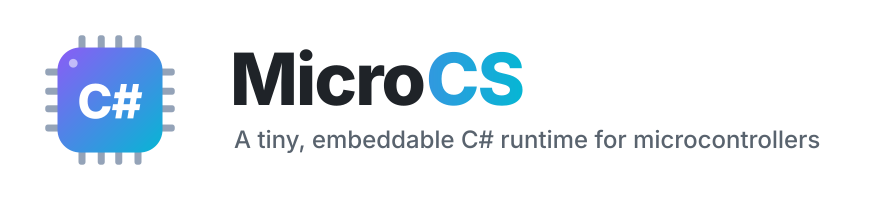
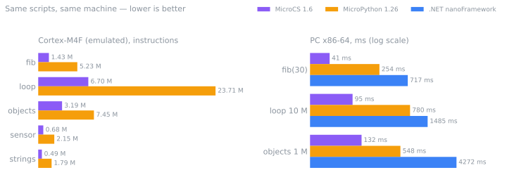
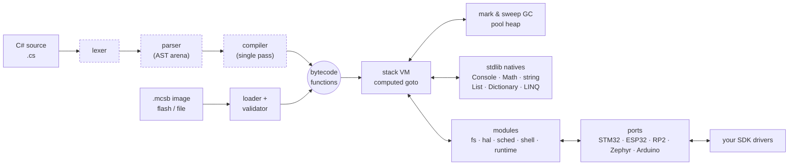
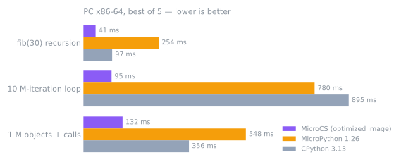

<div align="center" id="readme-top">

<picture>
  <source media="(prefers-color-scheme: dark)" srcset="assets/banner-dark.svg">
  
</picture>

**Write firmware logic in C#. Run it on any microcontroller. Update it without reflashing.**

[](https://github.com/amir1387aht/MicroCS/actions/workflows/ci.yml)
[](LICENSE)
[](docs/PORTING.md)
[](CHANGELOG.md)
[](docs/TESTING.md)
[](tools/verify_dotnet.sh)
[](docs/PORTING.md)

[**Getting started**](docs/GETTING_STARTED.md) ·
[**Hardware API**](docs/HAL.md) ·
[**Examples**](examples/README.md) ·
[**Porting**](docs/PORTING.md) ·
[**Language**](docs/LANGUAGE.md) ·
[**Library**](docs/STDLIB.md) ·
[**All docs**](docs/README.md)

</div>

---

<table>
<tr>
<td width="56%" valign="top">

MicroCS is a compact **C# compiler + bytecode VM** written in portable C99 — no dependencies,
no `malloc` or OS required. It gives a microcontroller a real, modern C#: classes, generics, lambdas,
LINQ, tuples, pattern matching, exceptions, plus a complete peripheral API.

Embed it as a **library** in the firmware you already have, or flash it as a **MicroPython-style
REPL device**. Scripts run from source on the device, or as precompiled, optimized bytecode
straight from flash.

</td>
<td width="44%" valign="top">

```csharp
var led = new Pin("LED", GPIO.Output);
I2C.Open(0, 400_000);
var sensor = new I2cDevice(0, 0x48);

Scheduler.Every(1000, () => {
    double t = sensor.ReadRegister(0) * 0.5;
    led.Write(t > 30);
    Console.WriteLine($"{t,5:F1} °C");
});
```

</td>
</tr>
</table>

<div align="center">

| 🪶 **16 KB RAM · 64 KB flash** | ⚡ **~3× faster than MicroPython** | 🎯 **byte-identical to .NET 8** | 🔌 **14 peripheral classes** | 🧱 **8 build systems** |
|:---:|:---:|:---:|:---:|:---:|
| smallest supported part, built and run in CI | optimized bytecode images on Cortex-M | on every program in the test suite | GPIO · UART · I²C · SPI · ADC · DAC · PWM · CAN · I²S · … | Make · CMake · IDF · Cube · pico-sdk · Zephyr · PIO · Arduino |

</div>

> [!TIP]
> **New in 1.6 — fast bytecode images.** `mcs -c` now optimizes: superinstructions, loop
> rotation, method and constructor caches and a compact image format. Precompiled images run
> **1.3–2.2× faster than in 1.5** on Cortex-M, beat on-device compilation by up to 2× with up to
> half the RAM, and are usually smaller than the source. [Changelog](CHANGELOG.md) ·
> [numbers](docs/PERFORMANCE.md#16--fast-bytecode-images)

<details>
<summary><b>📑 Contents</b></summary>

- [Why MicroCS](#-why-microcs)
- [Two ways to use it](#-two-ways-to-use-it) — [① library](#-option-1--drop-the-library-into-an-existing-project) · [② REPL firmware](#-option-2--build-a-complete-c-firmware-with-a-repl)
- [Try it on your PC](#-try-it-on-your-pc-one-minute)
- [Hardware in C#](#-hardware-in-c) · [Build systems](#-works-with-every-build-system) · [Targets](#-supported-targets)
- [Language at a glance](#-language-at-a-glance) · [vs MicroPython / nanoFramework](#%EF%B8%8F-microcs-vs-micropython-vs-net-nanoframework)
- [Architecture](#%EF%B8%8F-architecture) · [Performance & footprint](#-performance--footprint)
- [Status](#-status) · [Roadmap](#%EF%B8%8F-roadmap) · [Repository layout](#-repository-layout) · [Contributing](#-contributing)

</details>

## ✨ Why MicroCS

<table>
<tr>
<td width="33%" valign="top">

### 🧩 Real C#
Output is **byte-identical to .NET 8** for every program in the test suite
(`tools/verify_dotnet.sh`). Prototype on your PC, run the same file on the board.

</td>
<td width="33%" valign="top">

### 🪶 Small & portable
One C99 library, no dependencies. Pool allocator included, feature flags and 7 build
profiles (`auto` sizes itself to the chip). Runs in **16 KB of RAM and 64 KB of flash**; a VM
starts in 1.7–8 KB of heap; bytecode can run straight from flash.

</td>
<td width="33%" valign="top">

### 🔌 Built for devices
14 peripheral classes, interrupt callbacks, a virtual filesystem (RAM, POSIX, LittleFS and
YAFFS2 on SPI NOR/NAND), a job scheduler, a REPL and a script-upload protocol for over-the-wire updates.

</td>
</tr>
<tr>
<td valign="top">

### 🛡️ Safe by default
Bounds-checked everything, hard heap cap, time/step budgets that scripts cannot catch,
catchable stack overflow, sandboxed paths, validated bytecode images. Fuzzed under
ASan + UBSan.

</td>
<td valign="top">

### ⚡ Fast
An optimizing image compiler (71 superinstructions, loop rotation), computed-goto dispatch,
method/field/constructor caches, precise mark & sweep GC. **2–9× faster than CPython 3.13**
on every benchmark in this repo.

</td>
<td valign="top">

### 🔁 Update without reflashing
Upload `.cs` or precompiled `.mcsb` files over the UART; a failed upload never replaces the
working version.

</td>
</tr>
</table>

## 🧭 Two ways to use it

Pick the one that matches your project:

| | **① Library inside your firmware** | **② Whole firmware = MicroCS REPL** |
|---|---|---|
| You have… | an existing project (CubeMX, ESP-IDF, pico-sdk, Zephyr, Arduino, bare metal…) | a board and want a MicroPython-style device |
| MicroCS does… | runs the C# you give it, calls your C functions, uses your drivers | owns the main loop: REPL on the UART/USB, files, `boot.cs`/`main.cs`, jobs, interrupts |
| Your C code | stays in charge (main loop, RTOS tasks, ISRs) | ~20 lines of board glue |
| Start here | [Option ①](#-option-1--drop-the-library-into-an-existing-project) | [Option ②](#-option-2--build-a-complete-c-firmware-with-a-repl) |

## ① Option 1 — drop the library into an existing project

Add the sources to your build (any build system, see the [matrix below](#-works-with-every-build-system)),
give the VM a heap and a print function, and run C#:

```c
#include "MicroCS.h"

static uint8_t heap[64 * 1024];                 /* the VM never calls malloc */
static mcs_pool_t pool;

static void print(void* ud, const char* s, size_t n) { uart_send(s, n); }   /* your driver */

void run_script(void) {
    mcs_config_t cfg;
    mcs_config_default(&cfg);
    mcs_pool_init(&pool, heap, sizeof heap);
    cfg.realloc_fn = mcs_pool_realloc;
    cfg.alloc_ud = &pool;
    cfg.write_fn = print;
    cfg.ticks_fn = my_millis;                    /* optional: time, Thread.Sleep */
    cfg.delay_fn = my_delay_ms;

    mcs_vm_t* vm = mcs_new(&cfg);
    mcs_exec_source(vm, "app.cs",
        "var temps = new List<double> { 21.5, 22.0, 23.25 };\n"
        "Console.WriteLine($\"average {temps.Average():F2} °C\");\n");
    mcs_free(vm);
}
```

Want C# to drive the board too? Add one port (or your own function table) and one line:

```c
#include "mcs_port_stm32.h"                      /* or mcs_port_esp32.h, mcs_port_rp2.h, ... */
static mcs_stm32_board_t board;  static mcs_hal_t hal;

board.uart[2] = &huart2;  board.i2c[1] = &hi2c1;  board.spi[1] = &hspi1;   /* CubeMX handles */
mcs_stm32_hal_init(&hal, &board);
mcs_hal_open_lib(vm, &hal);                       /* GPIO, Pin, UART, I2C, SPI, ADC, PWM, ... */
```

Expose your own C functions with a table — C# sees them as a static class:

```c
static mcs_value_t motor_speed(mcs_vm_t* vm, mcs_value_t self, int argc, mcs_value_t* argv) {
    motor_set_rpm((int)mcs_to_int(vm, argv[0]));          /* your existing driver */
    return mcs_null();
}
static const mcs_reg_t motor_fns[] = { MCS_FN("Speed", motor_speed, 1), MCS_REG_END };
mcs_register_module(vm, "Motor", motor_fns);              /* C#: Motor.Speed(1200); */
```

…and call C# from C with `mcs_call(vm, "OnButton", argc, argv, &result)`.
A complete, runnable version is [`examples/quickstart_embed.c`](examples/quickstart_embed.c)
(`make quickstart`); everything else is in [EMBEDDING.md](docs/EMBEDDING.md).

## ② Option 2 — build a complete C# firmware with a REPL

`mcs_runtime` turns the board into an interactive C# device: a REPL on the console, a
filesystem with `boot.cs` / `main.cs`, the scheduler, interrupt callbacks and the
script-upload protocol. This is the **entire** `main.c` for a Raspberry Pi Pico:

```c
#include "pico/stdlib.h"
#include "mcs_runtime.h"
#include "mcs_port_rp2.h"

static uint8_t heap[160 * 1024];
static mcs_runtime_t rt;
static mcs_hal_t hal;

int main(void) {
    stdio_init_all();
    mcs_rp2_cfg_t pins = MCS_RP2_CFG_DEFAULT;      /* Pico pin-out: UART0 GP0/1, I2C0 GP8/9 ... */
    mcs_rp2_hal_init(&hal, &pins);

    mcs_runtime_cfg_t cfg = MCS_RUNTIME_DEFAULTS;
    cfg.heap = heap;
    cfg.heap_size = sizeof heap;
    cfg.ramfs_size = 32 * 1024;                    /* or your LittleFS: cfg.fs_ops / cfg.fs_ctx */
    cfg.console = mcs_rp2_console_stdio();         /* USB CDC or UART */
    cfg.ticks = mcs_rp2_ticks;
    cfg.delay = mcs_rp2_delay;
    cfg.hal = &hal;
    for (;;) mcs_runtime_run(&rt, &cfg);
}
```

Flash it, open a serial terminal and type C#:

```text
MicroCS 1.6.0 C# REPL. .help for commands, Ctrl-E paste mode, Ctrl-A machine mode.
> var led = new Pin("LED", GPIO.Output);
> led.Toggle();
> led.Value
True
> I2C.Open(0, 400000);
> string.Join(", ", I2C.Scan(0).Select(a => $"0x{a:X2}"))
0x48, 0x50, 0x68
> Scheduler.Every(500, () => led.Toggle());      // keeps blinking while you type
> .ls
```

Upload a program from your PC (`/main.cs` also runs at every boot):

```sh
python3 tools/mcs_remote.py --port /dev/ttyACM0 put app.cs /main.cs + run /main.cs
python3 tools/mcs_remote.py --port /dev/ttyACM0 repl          # terminal (Ctrl-] quits)
```

Ready-made firmware projects: [`ports/rp2/example`](ports/rp2/example) (Pico / Pico 2),
[`ports/esp32/example`](ports/esp32/example) (ESP-IDF), [`ports/stm32/example_main.c`](ports/stm32/example_main.c)
(any CubeMX project), [`ports/zephyr/example`](ports/zephyr/example),
[`ports/arduino/examples/MicroCS_REPL`](ports/arduino/examples/MicroCS_REPL).
No board yet? `make && ./mcs --repl --sim` gives you the same REPL on your PC with a
simulated board. Details: [STANDALONE.md](docs/STANDALONE.md).

<p align="right"><a href="#readme-top">back to top ↑</a></p>

## 🚀 Try it on your PC (one minute)

```sh
git clone https://github.com/amir1387aht/MicroCS && cd MicroCS
make                                            # builds ./mcs (CLI, REPL, simulator)
./mcs -e 'Console.WriteLine($"Hello from C# {1 + 1}!")'
./mcs --repl --sim                              # the device REPL with a simulated board
./mcs --sim examples/hardware/05_i2c_temperature.cs
make test                                       # the whole test suite
```

<details>
<summary><b>More CLI recipes</b></summary>

```sh
./mcs app.cs                                   # compile + run source
./mcs -c app.cs && ./mcs app.mcsb              # precompile to a bytecode image, run it
./mcs -C app.cs -n app_image -o app_image.h    # image as a const C array for flash
./mcs --xip app.mcsb                           # run an image in place (no bytecode copy in RAM)
./mcs -d app.cs                                # disassemble (also works on .mcsb images)
./mcs --sim --sim-log app.cs                   # trace every peripheral access
./mcs --heap 65536 --stats app.cs              # small-MCU heap limit, print GC stats
./mcs --step-limit 100000 --time-limit 500 untrusted.cs
./mcs --shell --fs device_root                 # machine protocol on stdin/stdout
python3 tools/mcs_remote.py --exec "./mcs --shell --fs device_root" put app.cs /main.cs + run /main.cs
```

</details>

## 🔌 Hardware in C#

Every peripheral has a static API (`GPIO.Write(pin, 1)`) and, where it helps, an object API
(`new Pin("PA5")`, `new I2cDevice(bus, addr)`, `new SpiDevice(bus, cs, hz, mode)`).
Interrupt and timer callbacks are queued by the ISR and run in normal script context, so they
may allocate, print or call any API.

```csharp
var led    = new Pin("LED", GPIO.Output);
var button = new Pin(2, GPIO.InputPullUp);
button.OnChange(GPIO.Falling, (bool level) => led.Toggle());        // interrupt

I2C.Open(0, 400_000);
var imu = new I2cDevice(0, 0x68);
Console.WriteLine($"MPU-6050 id 0x{imu.ReadRegister(0x75):X2}");

var flash = new SpiDevice(0, 10, 8_000_000, 0);                      // chip select on pin 10
byte[] id = flash.WriteRead(new byte[] { 0x9F }, 3);

PWM.Servo(1, 90);                                                    // degrees
Timer.Start(0, 1_000, () => ADC.ReadMillivolts(0));                  // every 1 ms
CAN.Send(0, 0x123, new byte[] { 1, 2, 3 });
```

| Peripheral | C# API | STM32 | ESP32 | RP2040/RP2350 | Zephyr | Arduino |
|---|---|:---:|:---:|:---:|:---:|:---:|
| GPIO + interrupts | `GPIO` `Pin` | ✅ EXTI | ✅ | ✅ | ✅ | ✅ |
| UART (+ RX callback) | `UART` | ✅ IT ring | ✅ | ✅ IRQ ring | ✅ | ✅ any `Stream` |
| I²C | `I2C` `I2cDevice` | ✅ | ✅ | ✅ | ✅ | ✅ `Wire` |
| SPI | `SPI` `SpiDevice` | ✅ | ✅ | ✅ | ✅ | ✅ `SPI` |
| ADC | `ADC` | ✅ | ✅ calibrated mV | ✅ + temp sensor | ✅ | ✅ |
| DAC | `DAC` | ✅ where present | ✅ ESP32/S2 | — | ✅ | ESP32/SAMD |
| PWM / servo / tone | `PWM` | ✅ TIM | ✅ LEDC | ✅ every pin | ✅ | ✅ `analogWrite` |
| Hardware timers | `Timer` | ✅ TIM IRQ | ✅ gptimer | ✅ alarm pool | ✅ k_timer | software |
| I²S audio | `I2S` | ✅ | ✅ std mode | planned (PIO) | planned | — |
| QSPI / OctoSPI | `QSPI` | ✅ QSPI + OSPI | ✅ quad SPI | — | — | — |
| CAN / FDCAN | `CAN` `CanFrame` | ✅ bxCAN + FDCAN | ✅ TWAI | — | ✅ | — |
| Watchdog | `Watchdog` | ✅ IWDG | ✅ task WDT | ✅ | ✅ | where the core has one |
| RTC (Unix time) | `RTC` | ✅ | ✅ | ✅ | ✅ | ✅ software |
| Board info, µs clock, reset | `Hal` | ✅ | ✅ | ✅ | ✅ | ✅ |

Full reference: [HAL.md](docs/HAL.md) · generated API list: [STDLIB.md](docs/STDLIB.md) ·
16 commented, runnable scripts: [examples/hardware](examples/hardware/)
(blink, button IRQ, PWM fade/servo/tone, I²C scan, TMP102, MPU-6050, SPI, ADC voltmeter, DAC
wave, UART protocol, timers, I²S audio, QSPI flash, CAN, watchdog/RTC, data logger).

<p align="right"><a href="#readme-top">back to top ↑</a></p>

## 🧱 Works with every build system

MicroCS is plain C99 files plus one include directory, so it builds anywhere. Ready-made
integrations:

| Environment | How | Notes |
|---|---|---|
| **Make** (any project) | `include path/to/MicroCS/microcs.mk` → `$(MICROCS_SRCS)` `$(MICROCS_INCS)` | variables only, adds no rules |
| **CMake** | `add_subdirectory(MicroCS)` → `target_link_libraries(app microcs)` | options `MICROCS_PORT`, `MICROCS_PROFILE`, `MICROCS_MODULES` |
| **ESP-IDF** | `git clone https://github.com/amir1387aht/MicroCS components/MicroCS` | the same `CMakeLists.txt` registers the IDF component `MicroCS` |
| **STM32CubeIDE / CubeMX** | add `src/`, `modules/`, `ports/stm32` to the project, `include/` to the include paths | uses the Cube HAL headers of your project; family detected automatically |
| **pico-sdk** | `add_subdirectory(MicroCS)` with `MICROCS_PORT=rp2` | links the right `hardware_*` libraries |
| **Zephyr** | add as a west module, `CONFIG_MICROCS=y` | devicetree aliases select the devices |
| **PlatformIO** | `lib_deps = https://github.com/amir1387aht/MicroCS` | `library.json` picks the port from the framework |
| **Arduino IDE** | `python3 tools/make_arduino.py` → install `dist/arduino/MicroCS-1.6.0.zip` | `#include <MicroCS.h>` |
| Keil / IAR / SEGGER / others | add the `.c` files; nothing else needed | no compiler extensions required |

When MicroCS lives inside your SDK project it uses **your SDK's own headers and drivers**
(Cube HAL handles, ESP-IDF drivers, pico-sdk `hardware_*`, Zephyr devices) — it never ships
its own register definitions, so it follows whatever chip variant and clock setup you
configured. Tuning is done with `-D` flags or one config header
([`mcs_config.h`](include/mcs_config.h), 7 [profiles](include/profiles/)). The `auto`
profile picks the right one from the target's RAM and flash size — CMake `MICROCS_RAM_KB` /
`MICROCS_FLASH_KB`, Zephyr's `CONFIG_SRAM_SIZE`, or the STM32/RP2/nRF52/SAMD device macro;
it is the default for `MICROCS_PORT=stm32` and on Zephyr.

## 🎯 Supported targets

| Target | Port | Verified in CI |
|---|---|---|
| **STM32** C0 · F0 · F1 · F2 · F3 · F4 · F7 · G0 · G4 · H5 · H7 · L0 · L1 · L4 · L5 · U5 · WB · WL — parts with ≥ 16 KB RAM and ≥ 64 KB flash ([list](ports/stm32/README.md#supported-parts)) | [`ports/stm32`](ports/stm32) | compiled `-Werror` against the official STM32Cube HAL of each family, with the default and the `auto` profile |
| **ESP32** · S2 · S3 · C2 · C3 · C6 · H2 · P4 (no Wi-Fi/BLE needed) | [`ports/esp32`](ports/esp32) | example firmware built with ESP-IDF 5.3 for ESP32, S3, C2, C3, C6 |
| **RP2040 / RP2350** (Pico, Pico 2, Pico W…) | [`ports/rp2`](ports/rp2) | complete firmware built with pico-sdk for `pico` and `pico2` |
| Every **Zephyr** board (nRF52/53/54, NXP, STM32, SAM, …) | [`ports/zephyr`](ports/zephyr) | beta |
| Every 32-bit **Arduino** core (ESP32, RP2040, SAMD, nRF52, STM32duino, Teensy, UNO R4) | [`ports/arduino`](ports/arduino) | beta |
| Bare-metal Cortex-M0/M4/M33 reference firmware | [`ports/cortex-m`](ports/cortex-m) | built and executed by `make cm-check` |
| Linux / macOS host (CLI, REPL, simulator board) | [`ports/unix`](ports/unix) | full test suite |
| Your chip | [`ports/template`](ports/template) | fill in one table of function pointers |

## 🧩 Language at a glance

<table>
<tr><th>Works today</th><th>Not (yet) supported</th></tr>
<tr>
<td valign="top">

- classes, structs*, interfaces, inheritance, `virtual`/`abstract`/`override`, `base`
- properties, indexers, operator overloading, enums, events, delegates
- generics (erased), lambdas, closures, local functions
- `params`, default & optional arguments, overloads, initializers
- `switch` statements & expressions with type / relational / `or` / `when` patterns
- `is`/`as`, `?.`, `??`, `??=`, nullable members (`.HasValue`, `.Value`)
- `ref` / `out` / `in`, `out var`, `TryParse`, `TryGetValue`
- tuples, named elements, deconstruction, `_` discards
- index from end `^1`, ranges `a..b` on strings, arrays and lists
- exceptions, filters, `finally`, `using`, `foreach`, top-level statements
- string interpolation with alignment & format specifiers
- LINQ: `Where Select OrderBy GroupBy Zip Chunk Aggregate …`
- `Encoding.UTF8`, `BitConverter`, `StringBuilder`, `Stopwatch`, `Random`

</td>
<td valign="top">

- named arguments
- `yield`, `async`/`await`, `goto`
- multi-dimensional arrays `int[,]`
- records, primary constructors, default interface methods
- user-defined conversion operators
- reflection, `unsafe`, `dynamic`
- inheriting built-in collections

<sub>* structs have reference semantics.<br>
Generics are erased; strings are UTF-8, byte-indexed.<br>
Full list: <a href="docs/LANGUAGE.md">LANGUAGE.md</a> · API: <a href="docs/STDLIB.md">STDLIB.md</a></sub>

</td>
</tr>
</table>

<p align="right"><a href="#readme-top">back to top ↑</a></p>

## ⚖️ MicroCS vs MicroPython vs .NET nanoFramework

| | **MicroCS** | **MicroPython** | **.NET nanoFramework** |
|---|---|---|---|
| Language | modern C# subset (generics, LINQ, tuples, pattern matching) | Python 3 subset | C# (.NET subset, IL from Roslyn) |
| Compile on the device + REPL | ✅ both | ✅ both | ❌ compiled on the PC, no REPL |
| Use as a library inside your existing firmware | ✅ the main use case — one C99 library, your `main()` | possible (embed port), usually *is* the firmware | ❌ is the firmware (nanoCLR + its RTOS) |
| Build systems | Make, CMake, ESP-IDF, CubeIDE, pico-sdk, Zephyr, PlatformIO, Arduino, Keil/IAR | per-port Make/CMake | nanoCLR CMake build per target |
| Minimum footprint | **64 KB flash / 16 KB RAM** (`min` profile, precompiled images; built and run by CI). On-device compiler + REPL: ~240 KB flash (full build). A VM starts in 1.7–8 KB of heap | 256 KB flash / 16 KB RAM (official minimum) | 256 KB flash / 64 KB RAM (official minimum) |
| Speed on Cortex-M (same 5 scripts, emulated M4F + M0, same toolchain) | **2.3–3.7× fewer instructions** than MicroPython precompiled, 1.8–3.6× compiling on the device | 1× | not measured (no bare-metal build for the emulator) |
| Speed on a PC — fib(30) / 10 M loop / 1 M objects | **41 / 95 / 132 ms** | 254 / 780 / 548 ms | 717 / 1485 / 4272 ms (nanoCLR virtual device) |
| Smallest heap for those 5 scripts | 7.6–42 KB (incl. ~5.7 KB VM state + stack) | **0.7–21 KB** | not measured |
| Precompiled bytecode run from flash | ✅ XIP images, validated loader | ✅ frozen `.mpy` | ✅ PE files |
| Hard limits for scripts (time, steps, heap) | ✅ uncatchable budgets, abort from ISR | heap only | — |
| Interrupt callbacks | queued, run in script context (may allocate) | hard IRQ (no allocation) or `micropython.schedule` | events |
| Peripherals in the core API | GPIO, UART, I²C, SPI, ADC, DAC, PWM, Timer, I²S, QSPI, CAN, WDT, RTC | `machine`: similar set, varies by port | `System.Device.*` NuGet packages, varies by target |
| Same output as the desktop runtime | byte-identical to .NET 8 on the test suite | differs from CPython in places | .NET subset |
| Wi-Fi / BLE / networking | ❌ not yet ([roadmap](#-roadmap)) | ✅ | ✅ |
| Step debugger | ❌ not yet | ❌ | ✅ Visual Studio |
| Ecosystem | young | large | medium (NuGet) |

<p align="center"></p>

Where MicroCS wins: speed (about 3× MicroPython on Cortex-M, 4–8× on a PC, 16–32× the
nanoCLR on a PC), you keep your firmware and your toolchain, scripts cannot hang or starve
the device, and C# developers get a REPL on a $4 board. Where it does not (yet): heap use
on small scripts, networking stacks, a step debugger and the size of the ecosystem.
Method, all numbers and caveats: [PERFORMANCE.md](docs/PERFORMANCE.md#microcs-vs-micropython-vs-net-nanoframework)
· reproduce: [`bench/compare/`](bench/compare).

## 🏗️ Architecture



The compiler (dashed) is optional: ship only the VM and load precompiled images to save
~44 KB of flash and the compile-time RAM. Details: [ARCHITECTURE.md](docs/ARCHITECTURE.md) ·
[BYTECODE.md](docs/BYTECODE.md).

<p align="right"><a href="#readme-top">back to top ↑</a></p>

## 📊 Performance & footprint

<p align="center"></p>
<p align="center"></p>

| Cortex-M (gcc 13.2 `-Os`) | Flash | RAM | Heap after `mcs_new` | Demo as image | Demo from source |
|---|---:|---:|---:|---:|---:|
| **M0**, runtime only (no compiler) | 208.5 KB | 128 KB part | 8.0 KB | 2.96 M instr · 38.2 KB peak | — |
| **M0**, `lowram` profile, 40 KB pool | 196.5 KB | 64 KB part | 5.1 KB | 2.90 M instr · 30.0 KB peak | — |
| **M0**, [`examples/lowram`](examples/lowram/) node, 32 KB pool | 157.2 KB | 48 KB part | 1.8 KB | 0.95 M instr · 13.8 KB peak | — |
| **M0**, same node in **16 KB RAM** (`m0-16k`), 12 KB pool | 157.2 KB | 16 KB | 1.8 KB | 0.84 M instr · 11.0 KB peak | — |
| **M0**, `min` profile in **64 KB flash / 16 KB RAM** (`m0-64k`) | **60.6 KB** | 16 KB | 1.8 KB | 0.93 M instr · 10.4 KB peak | — |
| **M4F**, full | 253.1 KB | 192 KB part | 8.0 KB | 2.18 M instr | 3.73 M instr · 71.9 KB peak |
| **M33**, full (+ shell 259.2 KB) | 253.0 KB | 288 KB part | 8.0 KB | 2.18 M instr | 3.73 M instr |

**Images vs source** (`make mcu-bench`, Cortex-M4F, emulated instructions; images are
optimized with superinstructions, `-O0` = plain bytecode):

| `bench/mcu/` | Source size | Image size | From source | Image `-O0` | **Image** | vs 1.5 image | RAM peak src → image |
|---|---:|---:|---:|---:|---:|---:|---:|
| `fib` (recursion) | 102 B | 146 B | 2.07 M | 2.00 M | **1.43 M** | 1.7× faster | 31.4 → 15.1 KB |
| `loop` (int arithmetic) | 232 B | 166 B | 13.16 M | 13.07 M | **6.70 M** | 2.2× faster | 31.4 → 15.1 KB |
| `objects` (classes, fields, calls) | 406 B | 356 B | 3.64 M | 3.50 M | **3.19 M** | 1.8× faster | 72.2 → 72.2 KB |
| `sensor` (double math, arrays) | 581 B | 501 B | 0.95 M | 0.71 M | **0.68 M** | 1.3× faster | 40.7 → 17.0 KB |
| `strings` (string building) | 309 B | 311 B | 0.63 M | 0.50 M | **0.49 M** | 1.3× faster | 31.7 → 30.6 KB |

> [!NOTE]
> Instruction counts and memory peaks are measured by `make cm-check` and `make mcu-bench`. 1 KB = 1024 B. Flash
> includes newlib + libm (~49 KB; the `min` build uses the built-in tiny printf and no libm)
> and the optional modules. Method and raw data: [PERFORMANCE.md](docs/PERFORMANCE.md). For
> 16–64 KB RAM parts see [LOW_RESOURCE.md](docs/LOW_RESOURCE.md) and the firmware in
> [examples/lowram](examples/lowram/).

## 🚦 Status

✅ stable &nbsp;·&nbsp; 🧪 beta &nbsp;·&nbsp; 🗓️ planned

| Area | Status | Evidence |
|---|:---:|---|
| Interpreter core, GC, stdlib | ✅ | `make check`: GC-stress run of every program, 32 feature-flag / profile builds `-Werror`, whole suite under 12 configurations |
| 16 KB RAM / 64 KB flash (`min`, `auto` profiles) | ✅ | `m0-16k` and `m0-64k` executed by `make cm-check`, output identical to the host |
| Tuples, deconstruction, `^`/ranges, `ref`/`out`, patterns | ✅ | `t10`, `t11`, `t13` — byte-identical to .NET 8 |
| Bytecode images + optimizer, loader validation, XIP | ✅ | every test runs as source, optimized image **and** XIP image; image fuzzer |
| Hardware API v2 (14 classes, callbacks, events) | ✅ | `t08_hal`, `t15_hal_v2`, `examples/hardware/*` on the simulator board |
| REPL, standalone runtime, script manager | ✅ | `test_runtime` unit test, `test_shell.py`, `test_cm_shell.py` |
| STM32 / RP2 ports | ✅ | CI: 12 STM32 families compiled `-Werror`, Pico + Pico 2 firmware built |
| ESP32 port | ✅ | CI: ESP-IDF 5.3 builds for ESP32, S3, C2, C3, C6 |
| Zephyr / Arduino ports | 🧪 | API complete, community testing welcome |
| Flash filesystems: LittleFS, YAFFS2, SPI NOR / SPI NAND drivers | 🧪 | `make test` (drivers), `make lfs-test`, `make yaffs-test` on simulated chips with bad blocks — not yet on real chips |
| Wi-Fi/BLE, debugger, signed images | 🗓️ | [roadmap](#-roadmap) |

<p align="right"><a href="#readme-top">back to top ↑</a></p>

## 🗺️ Roadmap

- [x] **1.0–1.2** — compiler, VM, GC, stdlib, bytecode images, filesystem, scheduler, shell, tuples/ranges, fuzzing
- [x] **1.3** — small-MCU release: lowram profile, XIP images, VM baseline 50 → 25 KB
- [x] **1.4** — hardware API v2 (I²S, QSPI, CAN, DAC, timers, interrupts, watchdog, RTC), REPL runtime,
      STM32 / ESP32 / RP2040 / RP2350 / Zephyr / Arduino ports, CMake / ESP-IDF / PlatformIO / Arduino packaging
- [x] **1.5** — 16 KB RAM / 64 KB flash (`min` profile, lazy class tables, optional stdlib parts),
      `auto` profile per MCU, ESP32-C2, LittleFS + YAFFS2 on SPI NOR / NAND
- [x] **1.6** — fast images: bytecode optimizer + superinstructions, method/constructor caches,
      compact image format v3 (images 1.3–2.2× faster than 1.5 and smaller than the source)
- [ ] Wi-Fi + BLE modules (ESP32, Pico W), sockets, HTTP, MQTT
- [ ] RP2 PIO from C#, I²S on RP2 via PIO, DMA-backed SPI/I²S streaming
- [ ] Flash filesystems on internal flash in every port example, USB mass-storage
- [ ] CAN FD payloads, `async`/`await` over hardware events
- [ ] Source-level debugger over the shell protocol + VS Code extension
- [ ] Signed images + authenticated shell
- [ ] ROM-resident class metadata, LVGL bindings

<p align="right"><a href="#readme-top">back to top ↑</a></p>

## 📁 Repository layout

```
include/        public API: MicroCS.h, mcs.h, mcs_hal.h, mcs_runtime.h, config, profiles/
src/            core: lexer, parser, compiler, bytecode, VM, GC, stdlib
modules/        optional: fs/ (VFS, RAM, POSIX, LittleFS, YAFFS2, SPI NOR/NAND) hal/ sched/ shell/ runtime/
ports/          stm32 · esp32 · rp2 · zephyr · arduino · cortex-m · unix · template
examples/       hardware/ scripts, quickstart_embed.c, firmware_example.c, lowram/
tests/          *.cs with expected .out, C unit tests, protocol tests
tools/          remote shell, port checks, Arduino packager, fuzzer, doc generators
docs/           everything else → docs/README.md
CMakeLists.txt  microcs.mk  library.json  idf_component.yml  zephyr/   build integrations
```

## 🤝 Contributing

Bug reports, board ports and features are welcome — read [CONTRIBUTING.md](CONTRIBUTING.md)
first. The short version: `make check` must stay green, new language features need a test
whose output matches .NET (`tools/verify_dotnet.sh`), and docs must describe what the code does.

## 📄 License

[MIT](LICENSE) © MicroCS contributors. LittleFS (BSD-3-Clause) and YAFFS2 (GPLv2 or
commercial) are not bundled; `make lfs-test` / `make yaffs-test` download them for the tests.
Linking YAFFS2 into a firmware puts that firmware under YAFFS2's licence terms.
