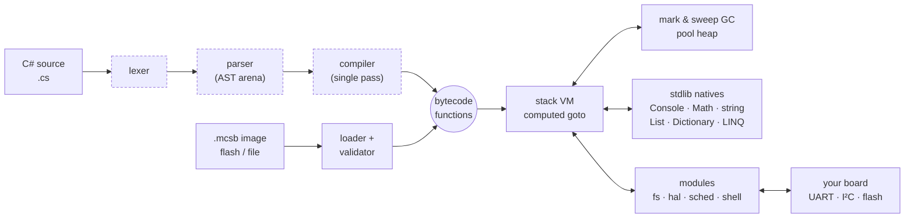

<div align="center">

<picture>
  <source media="(prefers-color-scheme: dark)" srcset="assets/banner-dark.svg">
  
</picture>

**Write firmware logic in C#. Run it on a microcontroller. Update it without reflashing.**

[](https://github.com/amir1387aht/MicroCS/actions/workflows/ci.yml)
[](LICENSE)
[](docs/PORTING.md)
[](CHANGELOG.md)
[](docs/TESTING.md)
[](tools/verify_dotnet.sh)
[](docs/PORTING.md)

[**Getting started**](docs/GETTING_STARTED.md) ·
[**Language**](docs/LANGUAGE.md) ·
[**Library**](docs/STDLIB.md) ·
[**Embedding**](docs/EMBEDDING.md) ·
[**Porting**](docs/PORTING.md) ·
[**Performance**](docs/PERFORMANCE.md) ·
[**All docs**](docs/README.md)

</div>

---

MicroCS is to C# what MicroPython is to Python: a compact compiler + bytecode VM in
**portable C99** that you drop into any firmware — bare metal, RT-Thread, FreeRTOS, Zephyr —
and then script in a practical subset of modern C#. Scripts can be compiled **on the device**
or ahead of time into a small **bytecode image** that lives in flash.

```csharp
// main.cs — runs on the board
GPIO.Mode(13, GPIO.Output);
Scheduler.Every(500, () => GPIO.Toggle(13));                 // blink, polled by the host loop

var (lo, hi) = (18.0, 26.5);                                  // tuples + deconstruction
Scheduler.Every(1000, () => {
    byte[] raw = I2C.WriteRead(0, 0x48, new byte[] { 0 }, 2); // TMP102-style sensor
    double t = ((raw[0] << 4) | (raw[1] >> 4)) * 0.0625;
    File.AppendAllText("/log.csv", $"{Environment.TickCount},{t:F2}\n");
    if (t is < 18.0 or > 26.5) Console.WriteLine($"out of range: {t:F1} °C ({lo}..{hi})");
});
```

## ✨ Highlights

<table>
<tr>
<td width="33%" valign="top">

### 🧩 Real C#
Classes, interfaces, generics, lambdas & closures, LINQ, pattern matching, `ref`/`out`,
tuples, ranges `x[1..^1]`, exceptions with filters, string interpolation — output
**byte-identical to .NET 8** for the verified test programs.

</td>
<td width="33%" valign="top">

### 🪶 Small & portable
One C99 library, no dependencies, no OS required. Pluggable allocator (pool heap
included), feature flags and 5 build profiles. A full VM starts in ~25 KB of heap,
a trimmed one in 13 KB; images can run straight from flash.

</td>
<td width="33%" valign="top">

### 🔌 Built for devices
GPIO / UART / I2C / SPI / ADC / PWM classes over a board table, a virtual filesystem
(RAM, POSIX, LittleFS), a job scheduler and a UART script manager for over-the-wire
updates.

</td>
</tr>
<tr>
<td valign="top">

### 🛡️ Safe by default
Bounds-checked everything, hard heap cap, time/step budgets that scripts cannot catch,
catchable stack overflow, sandboxed paths, validated bytecode images. Fuzzed under
ASan + UBSan.

</td>
<td valign="top">

### ⚡ Fast enough
Computed-goto dispatch, superinstructions, inline field caches, precise mark & sweep GC.
Faster than CPython 3.13 on every benchmark in this repo.

</td>
<td valign="top">

### 🧪 Honest status
Every claim below has a test or a measurement behind it. Things that are
experimental or planned are labelled so — see [Status](#-status).

</td>
</tr>
</table>

## 🚀 Quick start

```sh
git clone https://github.com/amir1387aht/MicroCS && cd MicroCS
make                          # builds ./mcs — CLI, REPL and standalone runtime
./mcs -e 'Console.WriteLine($"Hello from C# {1 + 1}!")'
make test                     # 46 script runs, 104 C unit checks, shell protocol tests
```

<details>
<summary><b>More CLI recipes</b></summary>

```sh
./mcs app.cs                                  # compile + run source
./mcs -c app.cs && ./mcs app.mcsb             # precompile to a bytecode image, run it
./mcs -C app.cs -n app_image -o app_image.h   # image as a const C array for flash
./mcs --xip app.mcsb                          # run an image in place (no bytecode copy in RAM)
./mcs -d app.cs                               # disassemble (also works on .mcsb images)
./mcs --sim tests/t08_hal.cs                  # peripherals against the simulator board
./mcs --heap 65536 --stats app.cs             # emulate a small MCU heap, print GC stats
./mcs --step-limit 100000 --time-limit 500 untrusted.cs
./mcs --shell --fs device_root                # standalone runtime on stdin/stdout
python3 tools/mcs_remote.py --exec "./mcs --shell --fs device_root" put app.cs /main.cs + run /main.cs
```

</details>

## 🔧 Embed it in 15 lines

```c
#include "mcs.h"
#include "mcs_vfs.h"
#include "mcs_hal.h"

static uint8_t heap[160 * 1024];
static mcs_pool_t pool;  static mcs_vfs_t vfs;  static mcs_hal_t hal;   /* fill hal with your board ops */

void script_task(void) {
    mcs_config_t cfg; mcs_config_default(&cfg);
    mcs_pool_init(&pool, heap, sizeof heap);
    cfg.realloc_fn = mcs_pool_realloc; cfg.alloc_ud = &pool;
    cfg.write_fn = uart_write; cfg.ticks_fn = millis; cfg.delay_fn = delay_ms;

    mcs_vm_t* vm = mcs_new(&cfg);
    mcs_limits_t lim = { .time_ms = 2000 };      mcs_set_limits(vm, &lim);  /* runaway scripts are stopped */
    mcs_fs_open_lib(vm, &vfs);                   /* File / Directory / Path  */
    mcs_hal_open_lib(vm, &hal);                  /* GPIO / UART / I2C / ...  */
    mcs_exec_file(vm, &vfs, "/main.cs");         /* source or .mcsb, auto-detected */
}
```

Expose your own C functions to C# with one table:

```c
static mcs_value_t led_set(mcs_vm_t* vm, mcs_value_t self, int argc, mcs_value_t* argv) {
    board_led(mcs_to_int(vm, argv[0]), mcs_truthy(argv[1]));
    return mcs_null();
}
static const mcs_reg_t board_fns[] = { MCS_FN("Led", led_set, 2), MCS_REG_END };
mcs_register_module(vm, "Board", board_fns);          /* C#: Board.Led(2, true); */
```

→ [EMBEDDING.md](docs/EMBEDDING.md) · [examples/firmware_example.c](examples/firmware_example.c) · [ports/cortex-m/main.c](ports/cortex-m/main.c)

## 🏗️ Architecture



The compiler (dashed) is optional: ship only the VM and load precompiled images to save
~44 KB of flash and the compile-time RAM. Details: [ARCHITECTURE.md](docs/ARCHITECTURE.md) ·
[BYTECODE.md](docs/BYTECODE.md).

## 🧩 Language at a glance

<table>
<tr><th>Works today</th><th>Not (yet) supported</th></tr>
<tr>
<td valign="top">

- classes, structs*, interfaces, inheritance, `virtual`/`abstract`/`override`, `base`
- properties, indexers, operator overloading, enums, events, delegates
- generics (erased), lambdas, closures, local functions
- `params`, default & optional arguments, overloads, initializers
- `switch` statements & expressions with type / relational / `or` / `when` patterns
- `is`/`as`, `?.`, `??`, `??=`, nullable members (`.HasValue`, `.Value`)
- `ref` / `out` / `in`, `out var`, `TryParse`, `TryGetValue`
- tuples, named elements, deconstruction, `_` discards, tuple dictionary keys
- index from end `^1`, ranges `a..b` on strings, arrays and lists
- exceptions, filters, `finally`, `using`, `foreach`, top-level statements
- string interpolation with alignment & format specifiers
- eager LINQ: `Where Select OrderBy GroupBy Zip Chunk Aggregate …`

</td>
<td valign="top">

- named arguments
- `yield`, `async`/`await`, `goto`
- multi-dimensional arrays `int[,]`
- records, primary constructors, default interface methods
- user-defined conversion operators
- reflection, `unsafe`, `dynamic`
- inheriting built-in collections

<sub>* structs have reference semantics.<br>
Generics are erased; strings are UTF-8, byte-indexed.<br>
Full list: <a href="docs/LANGUAGE.md">LANGUAGE.md</a> · API: <a href="docs/STDLIB.md">STDLIB.md</a></sub>

</td>
</tr>
</table>

## 📊 Performance & footprint

<p align="center"></p>
<p align="center"></p>

| Cortex-M (gcc 13.2 `-Os`, emulated) | Flash `.text` | Heap after `mcs_new` | Demo as image | Demo from source |
|---|---:|---:|---:|---:|
| **M0**, runtime only (no compiler) | 167.6 KB | 25.1 KB | 4.56 M instr · 63.5 KB peak | — |
| **M0**, `lowram` profile, 40 KB pool | 158.5 KB | 19.9 KB | 4.59 M instr · 33.3 KB peak | — |
| **M0**, [`examples/lowram`](examples/lowram/) node, 32 KB pool | 144.1 KB | 13.0 KB | 1.28 M instr · 27.4 KB peak | — |
| **M4F**, full | 213.5 KB | 25.3 KB | 3.47 M instr | 4.32 M instr · 88.4 KB peak |
| **M33**, full (+ shell 216.5 KB) | 213.4 KB | 25.3 KB | 3.47 M instr | 4.32 M instr |

> [!NOTE]
> Cortex-M numbers are *instruction counts* from the Unicorn emulator (`make cm-check`), not
> cycles on silicon. 1 KB = 1024 B. Flash includes newlib + libm (~49 KB) and the optional modules. Method and
> raw data: [PERFORMANCE.md](docs/PERFORMANCE.md).

### 🪫 Small MCUs (32–64 KB RAM)

Use `profiles/mcs_profile_lowram.h`, precompiled images run with `mcs_exec_image_xip()` and
a reduced `cfg.stdlib`. Every option, what it costs and what it saves:
[docs/LOW_RESOURCE.md](docs/LOW_RESOURCE.md) · a complete 48 KB-RAM firmware:
[examples/lowram](examples/lowram/).

```c
#define MCS_USER_CONFIG_FILE "profiles/mcs_profile_lowram.h"   /* or -D on the command line */
cfg.stdlib = MCS_LIB_CORE | MCS_LIB_COLLECTIONS;                 /* skip unused classes */
mcs_exec_image_xip(vm, node_image, sizeof node_image);          /* bytecode stays in flash */
```

## 🚦 Status

✅ stable &nbsp;·&nbsp; 🧪 experimental &nbsp;·&nbsp; 🗓️ planned &nbsp;·&nbsp; ⛔ not feasible

| Area | Status | Evidence |
|---|:---:|---|
| Interpreter core, GC, stdlib | ✅ | `make check`: GC-stress run of every program, 22 feature-flag builds `-Werror`, whole suite under 6 configurations |
| Tuples, deconstruction, `^`/ranges, `ref`/`out`, `case` patterns | ✅ | `t10`, `t11`, `t13` — byte-identical to .NET 8 |
| Bytecode images (v2) + loader validation | ✅ | every test runs as source, image **and** XIP image; image fuzzer (`tools/fuzz.py --image`) |
| Low-RAM profile, XIP images, compact values | 🧪 | `make check` (lowram config), `m0-lowram` / `m0-node` in `make cm-check`; emulated only |
| VFS (RAM / POSIX), `File` `Directory` `Path` | ✅ host | `t07_filesystem`, C unit tests |
| LittleFS backend | 🧪 | `make lfs-test` on a RAM block device; not yet on real flash |
| HAL + C# peripheral API | ✅ API · 🧪 drivers | `t08_hal` on the simulator board; no real board driver included |
| Scheduler, execution limits | ✅ | `t09_scheduler`, `err_limits` |
| Standalone shell / script manager | ✅ host + emulated M33 | `test_shell.py`, `test_cm_shell.py` |
| Cortex-M0 / M4 / M33 builds | 🧪 | 6 firmwares built with arm-none-eabi-gcc, 5 run in an emulator; **never on silicon** |
| RT-Thread / SiFli SF32LB525 port | 🗓️ | outline in [PORTING.md](docs/PORTING.md) |
| LVGL bindings, debugger, signed images, cron syntax | 🗓️ | [roadmap](#-roadmap) |
| 2 KB RAM / 16 KB flash "tiny" class | ⛔ | needs a different VM design (see PERFORMANCE.md) |

## 🗺️ Roadmap

- [x] **Phase 1** — compiler, VM, GC, stdlib, bytecode images
- [x] **Phase 2** — filesystem, HAL, scheduler, standalone shell, limits, Cortex-M ports
- [x] **1.2** — tuples, ranges, superinstructions, inline caches, loader hardening, fuzzing
- [ ] Real hardware bring-up: SF32LB525 + RT-Thread (board HAL, flash FS, UART transport)
- [x] **1.3** — small-MCU release: lowram profile, XIP images, VM baseline 50 → 25 KB, compact collections
- [ ] ROM-resident class metadata, streaming compilation
- [ ] LVGL module, async peripheral events, `FileStream`
- [ ] Signed images + authenticated shell, on-device debugger

## 📁 Repository layout

```
include/        public API: mcs.h, mcs_config.h, mcs_bind.h, module headers, profiles/
src/            core: lexer, parser, compiler, bytecode, VM, GC, stdlib
modules/        optional: fs/ hal/ sched/ shell/   (public API only)
ports/          unix (CLI) · cortex-m (bare-metal reference firmware) · template
examples/       C# examples, firmware embedding example, lowram/ 48 KB-RAM firmware
tests/          *.cs with expected .out, C unit tests, protocol tests
tools/          fuzzer, emulator harness, .NET parity check, size + doc generators
docs/           everything else → docs/README.md
```

## 🤝 Contributing

Bug reports, ports and features are welcome — read [CONTRIBUTING.md](CONTRIBUTING.md) first.
The short version: `make check` must stay green, new language features need a test whose
output matches .NET (`tools/verify_dotnet.sh`), and docs must describe what the code does.

## 📄 License

[MIT](LICENSE) © MicroCS contributors. LittleFS (BSD-3-Clause) is not bundled; `make lfs-test`
downloads it.
