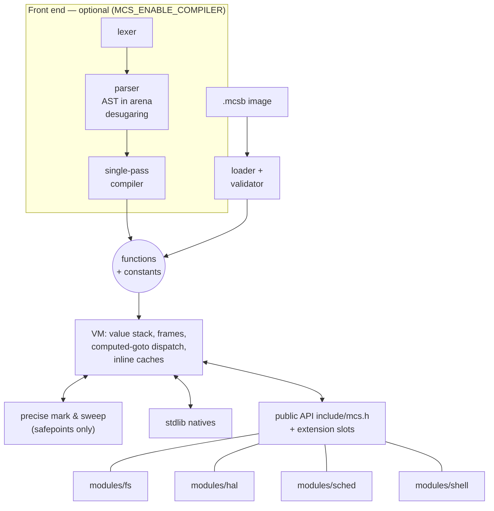

# Architecture

## Core (`src/`)
* **Lexer → parser → compiler.** The lexer produces a token array on the VM heap; the parser
  builds an AST in an arena and the token array is **freed as soon as parsing ends** (the
  AST points into the source text). Many newer features are *desugared* in the parser into
  calls of a hidden `__rt` module (tuples, deconstruction, `^`/ranges) or into existing
  nodes (`is` patterns → switch expressions), so the compiler and VM stay small. The
  compiler is single-pass per function, emits stack bytecode with line tables and recycles
  function-compiler states. The arena is freed after compilation, also on out-of-memory.
* **Peephole optimisation** happens at emit time: a store followed by `POP` becomes
  `SET_LOCAL_POP`/`SET_GLOBAL_POP`; conditions in `if`/`while`/`for`/`?:` that are a
  comparison become one fused `JF_*` compare-and-branch. Jump patching invalidates the
  peephole state so no rewrite crosses a branch target.
* **VM.** Value stack + call frames, computed-goto dispatch, exception handler stack,
  upvalues for closures. Hot paths: int/float arithmetic and comparisons, exact-arity
  closure calls, positive-divisor `/` `%`, and **per-site field caches** (`MCS_FIELD_CACHE`:
  each function has a `(class, slot)` cache indexed by the field-name constant; the GC marks
  the cached classes). *Safepoints* (calls, backward jumps, allocating opcodes) are the only
  places where the GC runs and where the host hook and execution limits are checked.
* **GC.** Precise mark & sweep. Allocation never collects; it only requests a collection
  that the next safepoint performs, so native code can hold unrooted temporaries. The weak
  string-intern table is rehashed in place when it fills with tombstones and shrunk after a
  collection when it is mostly empty.
* **Images.** `.mcsb` = serialised functions/constants with global names re-linked at load
  time; versioned (`IMG_VERSION` 2, v1 still accepted) and validated. See [BYTECODE.md](BYTECODE.md).
* **Library.** Builtin classes are described by `mcs_reg_t` tables; with `MCS_LAZY_REGS`
  a class's natives are only materialised on first use. [STDLIB.md](STDLIB.md) is generated
  from these tables.

## Phase 2 core additions (all append-only to `mcs.h`)
| API | Purpose |
|---|---|
| `mcs_set_ext / mcs_get_ext` | per-VM slots (VFS, HAL, SCHED, SHELL, 2 user) so modules need no globals |
| `mcs_set_limits`, `mcs_abort_reason`, `mcs_steps_used` | time/step budgets per top-level run |
| `mcs_fail(vm, code, fmt, ...)` | hosts/modules record + report an error outside script execution |
| `mcs_exec_auto`, `mcs_is_image` | run a buffer that is either source or an image |
| `mcs_features()` | runtime query of compiled-in features (`MCS_FEAT_*`) |

## Modules (modules/)
Modules include only public headers, are wrapped in their `MCS_ENABLE_*` flag and are
optional at link time. Each one registers C# classes with `mcs_register_module`/
`mcs_define_class` and stores its context in an extension slot.

* `fs`: `mcs_vfs_t` mount table (≤4 mounts, longest prefix, RDONLY/NOEXEC flags, path
  normalisation that cannot escape `/`), backends RAM (quota), POSIX (host directory),
  LittleFS (optional); C# `File`, `Directory`, `Path`. See FILESYSTEM.md.
* `hal`: one `mcs_hal_t` function table per board; NULL entries hide the C# class.
  Simulator backend for tests. See HAL.md.
* `sched`: fixed table of jobs (file or delegate), polled by the host. See SCHEDULER.md.
* `shell`: boot sequence and line protocol over any byte transport. See STANDALONE.md.

## Threading model
One VM = one thread. The scheduler and shell never create threads; the host drives them
from its loop or RTOS task. Several VMs may exist in one process (state is per VM; the
only process-wide state is the LittleFS file-handle table and C caches documented there).

## Invariants for contributors
* Do not change existing public structs/functions; append new API.
* Opcodes are append-only; bump `IMG_VERSION` if the image format changes, and extend the
  loader's operand validation for new operand kinds.
* Never trigger GC inside `mcs_realloc`; new VM roots must be marked in `mark_roots`.
* `.out` files define behaviour; new language features should match .NET output
  (`tools/verify_dotnet.sh`).
