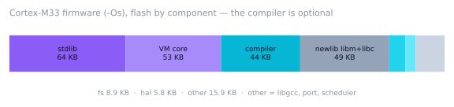

# Performance and footprint

> [!IMPORTANT]
> Every number on this page was produced in this repository's sandbox with the command next
> to it. Nothing here was measured on physical hardware; Cortex-M figures are *instruction
> counts* in an emulator, not cycles.

## 1.6 — fast bytecode images

Up to 1.5 an image held exactly the bytecode the on-device compiler produces, so running an
image only saved the compile step. 1.6 makes images a separate, faster path:

* **Optimizer** (`src/mcs_opt.c`, run by `mcs -c` / `mcs_compile_image`): fuses common
  sequences into **superinstructions** — local ± immediate (`LI_ADD L1 - 1`), local ⊕ local /
  constant with optional store (`BIN_LLS`, `BIN_LKS`), compare-and-branch on locals and
  immediates (`JFLI_LT`, `JFLL_LT`, `JF_LK`), accumulate (`ACC_ADD x += …`), `a[i]` / `a[i] = v`
  on locals, `obj.f` on a local, `return local`, constant folding of `(double)1`. Then jump
  threading, loop rotation (the loop test moves to the bottom: one branch per iteration),
  dead-code removal and relayout. Full list: [BYTECODE.md](BYTECODE.md#superinstructions-v2).
* **VM**: stack pointer kept in a register, int fast paths that work on the stack in place,
  `array.Length` / `list.Count` / `string.Length` without a method lookup, a **method inline
  cache** for `INVOKE` (per call site, invalidated by a class epoch), a constructor cache for
  `new C()`, a direct closure-call path, cheaper returns.
* **Compact image format v3**: varints, delta-coded line tables, every string stored once
  (names, file names and constants are shared). Images shrink by 25–45 % and are now smaller
  than the source for all but tiny scripts.
* Compiler fixes found on the way: hoisted functions keep their declared return type (no
  extra `CONV`), typed top-level variables are typed inside functions declared before them
  (`double ema = 0; void F() { ema = ema * 0.5; }` used integer arithmetic before 1.6).

`mcs -O0 -c` writes an unoptimized image (for VMs built with `MCS_ENABLE_SUPEROPS=0`); source
run on the device is not optimized unless `MCS_OPTIMIZE_SOURCE=1` (costs compile RAM/time).

### Images vs source on Cortex-M — `make mcu-bench`

`tools/mcu_bench.sh` runs `bench/mcu/*.cs` in one firmware as optimized image, `-O0` image and
from source (M4F: full build; M0: runtime only, no compiler) and checks every output against
the host. Emulated instructions for the whole run (load + execute; source = compile + run).
RAM peak = pool high-water mark.

| Cortex-M4F | Source | Image | From source | Image `-O0` | **Image** | 1.5 image | Peak src / image |
|---|---:|---:|---:|---:|---:|---:|---:|
| `fib` | 102 B | 146 B | 2.07 M | 2.00 M | **1.43 M** | 2.43 M | 31.4 / 15.1 KB |
| `loop` | 232 B | 166 B | 13.16 M | 13.07 M | **6.70 M** | 15.0 M | 31.4 / 15.1 KB |
| `objects` | 406 B | 356 B | 3.64 M | 3.50 M | **3.19 M** | 5.64 M | 72.2 / 72.2 KB |
| `sensor` | 581 B | 501 B | 0.95 M | 0.71 M | **0.68 M** | 0.87 M | 40.7 / 17.0 KB |
| `strings` | 309 B | 311 B | 0.63 M | 0.50 M | **0.49 M** | 0.63 M | 31.7 / 30.6 KB |

| Cortex-M0 (runtime only) | Image `-O0` | **Image** |
|---|---:|---:|
| `fib` | 2.60 M | **1.95 M** |
| `loop` | 20.74 M | **13.23 M** |
| `objects` | 4.71 M | **4.37 M** |
| `sensor` | 1.23 M | **1.21 M** |
| `strings` | 0.78 M | **0.77 M** |

Where the time goes now: `sensor` is dominated by soft-float `double` arithmetic
(`MCS_FLOAT_DOUBLE=1`; the M4F FPU is single precision — `MCS_FLOAT_DOUBLE=0` uses it),
`strings` by string allocation and the GC, `objects` by allocation; script-level dispatch is
no longer the bottleneck for those. `fib` is call/return-bound (~170 instructions per call).

### Demo and host

| | 1.5 | 1.6 | Change |
|---|---:|---:|---:|
| `demo.cs` image, Cortex-M0 (`m0-runtime`) | 4.54 M instr | 2.96 M instr | −35 % |
| `demo.cs` image, Cortex-M4F (`m4-full`) | 3.44 M instr | 2.18 M instr | −37 % |
| `demo.cs` from source, Cortex-M4F | 4.41 M instr | 3.73 M instr | −15 % |
| `examples/lowram` on `m0-64k` | 0.93 M instr | 0.93 M instr | ±0 (`min`: plain `-O0` image, no caches) |
| host `bench/fib.cs` image (fib 30) | 73.0 ms | 41.1 ms | −44 % |
| host `bench/loop.cs` image (10 M iterations) | 322 ms | 95 ms | −70 % |
| host `bench/objects.cs` image (1 M objects) | 241 ms | 132 ms | −45 % |
| host `demo.cs` image run | 348 µs | 224 µs | −36 % |
| host image sizes fib / loop / objects / demo | 318 / 277 / 673 / 2763 B | 226 / 220 / 440 / 1942 B | −29 to −35 % |
| host `demo.cs` compile to image | 83 µs | 120 µs | +45 % (optimizer; on the PC) |

CPython 3.13 in the same session (`bench/*.py`, in-process, best of 5): fib **97 ms**, loop
**895 ms**, objects **356 ms** — MicroCS 1.6 images are 2.4×, 9.4× and 2.7× faster.

Host rows: `make bench` of the 1.5 and 1.6 trees back to back in one session (x86-64, gcc
11.5 `-O2`). Cortex-M rows: `make cm-check`.

### Flash cost

The superinstruction handlers and caches add about **8–11 KB** of Thumb code
(`m0-runtime` 197.6 → 208.5 KB, `m4-full` 242.0 → 253.1 KB). `profiles/mcs_profile_min.h`
sets `MCS_ENABLE_SUPEROPS=0` and `MCS_FIELD_CACHE=0` so the 64 KB-flash build keeps its margin
(60.6 KB with this toolchain; Ubuntu's newlib adds ~0.9 KB); such VMs run
`-O0` images and reject optimized ones with a clear error. `MCS_ENABLE_SUPEROPS=0` saves the
same on any build; `MCS_FIELD_CACHE=0` saves another ~1 KB.

## Host interpreter — `make bench`

x86-64 Xeon @ 2.9 GHz, gcc 11.5 `-O2`, best of 5. "Compile" = source → image without running.
Host timings vary by ±10 % between runs on this shared machine — and by much more between
days (the same binary ran fib in 74 ms and in 120 ms on different days). Compare numbers
only within one session. The table below is from the 1.2.0 release; the 1.3.0 comparison
is in [What changed in 1.3](#what-changed-in-13).

| Script | Source | Image | VM new | Compile | Run (from source) | Run (image) |
|---|---:|---:|---:|---:|---:|---:|
| `bench/fib.cs` (fib 30) | 174 B | 318 B | 30–47 µs | 12–17 µs | 80–94 ms | **74 ms** |
| `bench/loop.cs` (10 M iterations) | 182 B | 277 B | 30 µs | 8–10 µs | 332 ms | **330 ms** |
| `bench/objects.cs` (1 M objects) | 462 B | 642 B | 30 µs | 27 µs | 238 ms | **232 ms** |
| `ports/cortex-m/demo.cs` | 2533 B | 2763 B | 30 µs | 137 µs | 0.45 ms | **0.34 ms** |

CPython 3.13 on the same machine (`bench/*.py`): fib **109 ms**, loop **931 ms**, objects **386 ms**.

### What changed in 1.3

1.3 is about RAM and flash on small parts; run speed on the host is unchanged. Same machine,
same session, 1.2.0 vs 1.3.0 builds (host) and `make cm-check` (Cortex-M, instructions):

| | 1.2.0 | 1.3.0 | Change |
|---|---:|---:|---:|
| fib(30) / 10 M loop / 1 M objects, host | 89 / 385 / 311 ms | 89 / 385 / 311 ms | ±0 (noise) |
| `mcs_new`, host | 43 µs | 30 µs | −30 % |
| demo compile, host | 201 µs | 140 µs | −30 % |
| demo heap peak, host | 116 438 B | 87 510 B | −25 % |
| heap after `mcs_new`, Cortex-M0 | 50 136 B | 25 688 B | −49 % |
| demo image on Cortex-M0 | 18.2 M instr | 4.56 M instr | −75 % |
| demo image on Cortex-M0, pool peak | 86 096 B | 64 984 B | −25 % |
| demo image on Cortex-M4 | 3.29 M instr | 3.47 M instr | +5 % |
| demo compile + run on Cortex-M4, pool peak | 131 528 B | 90 480 B | −31 % |
| demo from source on Cortex-M4 | 4.92 M instr | 4.32 M instr | −12 % |
| 700-string `HashSet`, host | 104.3 KB | 58.3 KB | −44 % |
| 100-entry `Dictionary<int,int>`, host | 12.1 KB | 4.3 KB | −64 % |

Where it came from (details in [LOW_RESOURCE.md](LOW_RESOURCE.md)):
* **`MCS_COMPACT_VALUES`** — 12-byte values with 4-byte alignment on 32-bit targets. On
  the M0 + newlib-nano a 16-byte 8-aligned value copy was a `memcpy` call; now it is three
  word moves. On the M4 the packed `double` loads cost ~2 % instructions; the rest of the +5 % is
  spread over the RAM-saving changes below and was not broken down further. Turn it off with
  `-DMCS_COMPACT_VALUES=0` if speed matters more than RAM.
* **Smaller VM baseline** — keys-only intern set, global slots stored in the name string,
  one shared field layout for all built-in exceptions, hash tables starting at 4 entries.
* **Compact `Dictionary`/`HashSet` index** — 1/2/4-byte position slots; `HashSet` has no
  values array.
* **Compiler RAM** — 24-byte tokens on 32-bit, smaller AST nodes, token array sized by the
  observed token density.

### What changed in 1.2

| | 1.1 (Phase 2) | 1.2 | Change |
|---|---:|---:|---:|
| fib(30) | 93 ms | 74 ms | −20 % |
| 10 M loop | 424 ms | 330 ms | −22 % |
| 1 M objects | 240 ms | 232 ms | −3 % |
| demo on Cortex-M4, image | 3.96 M instr | 3.29 M instr | −17 % |
| demo on Cortex-M4, from source | 5.79 M instr | 4.92 M instr | −15 % |
| demo compile, host heap peak | 200 KB | 168 KB | −16 % |
| demo compile, M4 pool peak | 162.9 KB (limit-bound) | 131.5 KB | −19 % |

Where it came from:
* **Superinstructions** (image v2): `SET_LOCAL_POP` / `SET_GLOBAL_POP` for statement stores and
  fused compare-and-branch `JF_EQ … JF_GE` for `if`/`while`/`for`/`?:` conditions — fewer
  dispatches and no boolean push/pop on the hot path.
* **Inline field cache** (`MCS_FIELD_CACHE`): each `GET_FIELD`/`SET_FIELD` site remembers
  `(class, slot)`; a hit skips the hash lookup.
* **Call fast path** for closures called with exact arity (no `params`, no defaults).
* **Integer `/` and `%` fast path** for positive divisors.
* **Token array freed after parsing** and allocated on the VM heap instead of being kept
  until compilation ends.

## Cortex-M — `make cm-check`

arm-none-eabi-gcc 13.2.1, `-Os`, newlib-nano, executed in the Unicorn emulator. 1 KB = 1024 B.

| | m0-runtime | m0-lowram | m0-node | m4-full | m33-full |
|---|---:|---:|---:|---:|---:|
| Config | default, no compiler | lowram profile | lowram, no modules, 2 lib groups | default | default |
| Flash `.text` (whole firmware) | 171 608 B | 162 272 B | 147 536 B | 218 608 B | 218 504 B |
| VM creation (`mcs_new` + modules) | 161 859 instr | 156 983 instr | — | 131 122 instr | 131 100 instr |
| Heap after `mcs_new` | 25 688 B | 20 332 B | 13 296 B | 25 904 B | 25 904 B |
| Workload | demo image | demo image | `examples/lowram` | demo image + source | demo image + source |
| Image run: instructions | 4.56 M | 4.59 M | 1.28 M (whole firmware) | 3.47 M | 3.47 M |
| Source (compile + run): instructions | n/a | n/a | n/a | 4.32 M | 4.32 M |
| Pool peak (whole run) | 64 984 of 102 400 B | 34 076 of 40 960 B | 28 044 of 32 768 B | 90 480 of 163 840 B | 90 480 of 262 144 B |
| C stack peak (painted) | 2.2 KB | 2.1 KB | — | 4.1 KB | 4.1 KB |

`m33-shell` (the UART script-manager firmware) is 221 688 B. The M0 needs ~1.3× the
instructions of the M4 for the demo — it has no hardware divider, no `IT` blocks and mostly
16-bit Thumb-1 encodings. (In 1.2 it was 5.5×; most of that was the `memcpy` per value copy
that `MCS_COMPACT_VALUES` removed.) Per-function profiles: `python3 tools/cm_emu.py
build/cm/m0-runtime.elf --cpu m0 --profile 20`.

### Flash by component — `python3 tools/map_sizes.py build/cm/m33-full.map`

| Component | Bytes |
|---|---:|
| MicroCS stdlib | 65 500 |
| MicroCS VM core (VM, GC, objects, image loader) | 53 822 |
| MicroCS compiler (lexer, parser, codegen) | 44 656 |
| newlib libm | 25 900 |
| newlib libc (printf incl. float, strtod) | 24 310 |
| module fs (VFS, RAM FS, File API) | 9 071 |
| libgcc (soft double, division) | 7 974 |
| port (`main.c` incl. the demo image) | 6 760 |
| module hal (+ simulator) | 5 925 |
| module scheduler | 1 428 |

Linker input sections after `--gc-sections`; mergeable string literals are counted before
merging, so the total is a little above `size`'s `.text`.

### Profiles
MicroCS objects only (all modules, no libc), Cortex-M0 `-Os`, before `--gc-sections`:

| Build | default | `embedded` | `mcu` | `lowram` | `lowram` + `MCS_ENABLE_LINQ=0` | `tiny` |
|---|---:|---:|---:|---:|---:|---:|
| Code | 171.1 KB | 169.1 KB | 120.7 KB | 111.3 KB | 99.5 KB | 84.3 KB |

What each profile turns off and the per-option savings: [LOW_RESOURCE.md](LOW_RESOURCE.md#8-flash).

## Memory notes

* **Fixed in 1.2 — intern table growth**: scripts that create many short-lived strings made
  the weak string-intern table fill with tombstones and double forever until the heap limit
  was hit (`OutOfMemory` after a few hundred thousand concatenations in a 128 KB heap).
  The table now rehashes in place when most used slots are tombstones and shrinks after a
  collection. Regression test: `tests/t12_memory_churn.cs` (`--heap 131072`).
* **Fixed in 1.1**: an out-of-memory panic during compilation leaked the AST arena;
  compiler states were not recycled; the token array was over-allocated.
* **Fixed in 1.3 — VM baseline**: stdlib metadata dropped from ~50 KB to ~25 KB of heap per
  VM (13 KB with only `MCS_LIB_CORE | MCS_LIB_COLLECTIONS`). Moving the remaining method
  tables and names to ROM is still the main lever left (planned).
* **Open**: compiling needs the whole AST of a script in RAM (the M4 run that also compiles
  the demo on the device peaks at 88.4 KB of pool; image-only runs fit in 33 KB). Use
  precompiled images — ideally with `mcs_exec_image_xip()` — on small parts; streaming
  per-declaration compilation is planned.

## Feasibility of a "tiny" target (2 KB SRAM / 16 KB flash)
Not achievable with this VM: the smallest build is ~84 KB of code and the smallest
measured working configuration (`examples/lowram`) needs a 24–32 KB heap. A tiny profile would need a separate design (static typing at
compile time, no GC, no reflection-style metadata, ahead-of-time images only). It is
listed as research, not as a supported target.
